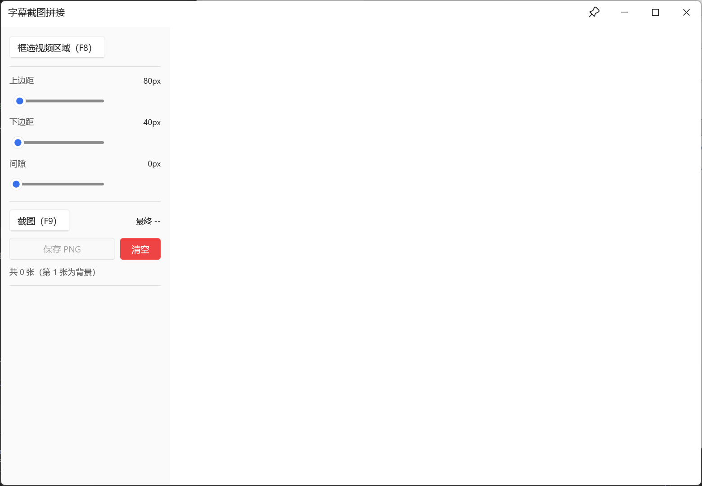
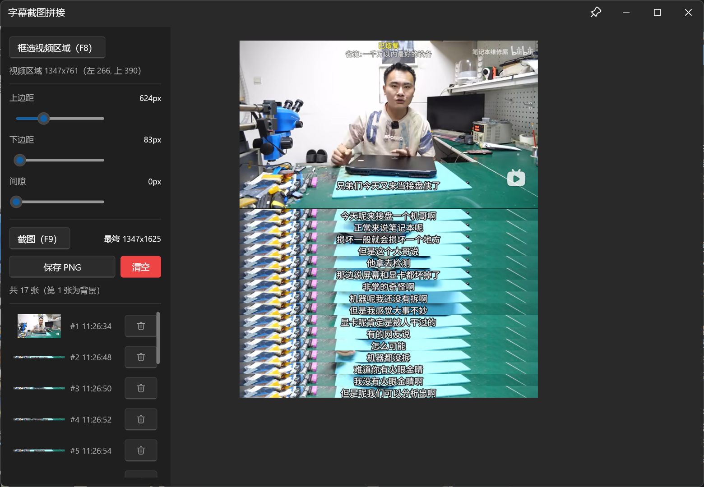

# 字幕截图拼接工具

手动截取视频字幕并拼接成长图的轻量化Windows工具。按F9截图，去除边缘并拼接，实时预览，最终导出 PNG 长图。

## 功能

- **F8** 框选视频区域（支持跨屏）
- **F9** 截图；第一张为背景图
- **实时预览**：每次截图后增量更新拼图预览（为提高预览性能与减小拼接缓存内存占用，预览上限 960px 宽，放大查看时糊属正常）；**导出仍为高清原图**
- **截图管理**：缩略图列表，可单独删除任意一帧
- **自适应深浅色主题**：自动检测 Windows 深浅色模式（`AppsUseLightTheme`）并切换 UI 主题
- **窗口置顶**：标题栏置顶按钮

## 技术要点

- 纯C++编写 + [果核剥壳core-ui](https://github.com/ghboke/core-ui/)（轻量化UI框架），单 `main.cpp`，无第三方Runtime依赖，轻量化，小而美
- **截图即压缩**：截图时即编码为 JPEG 存入内存，不保留原始位图，大幅降低长会话内存占用
- **增量拼接**：维护全局拼图缓存，新帧只移动旧行并追加新行，再整图推送视图；视图采用**逻辑高度**（`PushCacheToView(full, logicalH)`）驱动渲染，避免增量更新拖影
- **缩略图版本号**：`t{id}_v{gen}.png`——ImageWidget 按 src 字符串缓存资源且同 src 不重新加载（缩略图必须以版本号命名才能强制刷新，旧资源会自动清理）
- **UI 定义内嵌**：`app.uix` 作为 RCDATA 资源编译进 exe，单文件发布
- **Release 静态链接** core-ui 且 /MT 静态 CRT，输出单 exe，零运行时依赖（无需 vc_redist）

## 使用

1. 启动后按 **F8**，拖拽框选整个视频区域
2. 播放视频，在字幕显示完整时按 **F9** 截图
3. 调整 上边距/下边距与间隙，预览实时更新
4. 可删除误截的帧
5. 点 **保存 PNG** 导出长图

<table align="center">
  <tr>
    <td></td>
    <td></td>
  </tr>
</table>

## 构建

环境：Windows 10/11 x64，Visual Studio 2026（v145工具集，MSVC 14.5x），Windows SDK 10.0.26100，CMake 3.20+，Ninja。

本项目依赖 [修改版果核剥壳core-ui](../../../core-ui-mod)。目录布局：

```
工作区/
└── manualsubtitleshot_coreui/
    ├── core-ui/      # core-ui 库（include + lib/static + lib/dynamic，见下）
    └── manualsubtitleshot_coreui.slnx
```

Debug（vs设置为动态链接）与 Release（vs设置为静态链接）需要 core-ui 两套产物。（故意这么设置的，也可以都设为static或dynamic）

### 第一步：获取 core-ui

**方式 A（不推荐）：下载预编译 release**

从 [原版果核core-ui Releases](https://github.com/ghboke/core-ui/releases) 下载 `core-ui-v1.7.0-windows-x64.zip`，解压后把 `core-ui-v1.7.0\` 目录放到本仓库根（与 `manualsubtitleshot_coreui.slnx` 同级）即可。包内已含 dynamic（`core-ui.dll` + 导入库）与 static（含 QuickJS / LunaSVG 的 `core-ui.lib`）两套产物。

> **注意（为什么 Release 必须自编 static 库）**：官方预编译包里的 static `core-ui.lib` 是按 **/MD（动态 CRT）** 编译的core-ui代码虽然静态进了 exe，但 MSVC 运行库（vcruntime140.dll / msvcp140.dll 等）仍需目标机器安装 **VC++ Redistributable**，否则启动报"缺少 VCRUNTIME140.dll"。而且它与本仓库 Release 的 /MT 配置不匹配，会直接链接失败（LNK2038 `RuntimeLibrary` 不匹配）。
> 
> 版本目录名来自 core-ui 的 `VERSION`（当前 `v1.7.0`），升级 core-ui 后路径相应变化。
> 
> 本仓库 Release 目标是**零运行时依赖的单 exe**（/MT 静态 CRT，连 MSVC 运行库也一起编进 exe，不需要 vc_redist），因此改用方式 B 自编 static 库替换。Debug 则用上面方式 A 下载的动态库（core-ui.dll + 导入库）即可，不受影响。
> 
> 原版Release不支持用鼠标微调滑块，mod版加上了该功能


**方式 B：从源码构建**

```
git clone https://github.com/XE-i23333/core-ui-mod.git
```

参照[果核core-ui文档](https://github.com/ghboke/core-ui#build)


在 **Visual Studio Developer PowerShell**（或已执行过 `vcvars64.bat` 的 PowerShell）中，clone 源码后用 CMake 构建。假设：`$COREUI` = coreui源码目录，项目根 = `manualsubtitleshot_coreui/`。

Dynamic core-ui（Debug用）—— 产出 `core-ui.dll` + 导入库，install 前缀设为项目根，自动生成 `core-ui\`：

```powershell
cmake -S "$COREUI" -B "$COREUI\build" -G Ninja -DCMAKE_BUILD_TYPE=Release -DUI_CORE_BUILD_STATIC_ARCHIVE=OFF
cmake --build "$COREUI\build" --target core-ui
cmake --install "$COREUI\build" --prefix "<项目根>"
```

Static core-ui（Release用，**必须自编**）—— 产出全静态 fat 归档 `core-ui-fat.lib`（含 QuickJS / LunaSVG，可单 exe 发行）。fat 合并只在 SHARED 分支（不要加 `-DUI_CORE_STATIC=ON`），配 `UI_CORE_MSVC_STATIC_CRT=ON` 让全部对象（含 qjs / lunasvg / plutovg）都用 **/MT 静态 CRT** 编译：

```powershell
cmake -S "$COREUI" -B "$COREUI\build-fat" -G Ninja -DCMAKE_BUILD_TYPE=Release `
  -DUI_CORE_MSVC_STATIC_CRT=ON
cmake --build "$COREUI\build-fat" --target core-ui-fat-static
Copy-Item "$COREUI\build-fat\core-ui-fat.lib" "<项目根>\core-ui\lib\static\core-ui.lib" -Force
```

最终 `manualsubtitleshot_coreui\core-ui\` 内容：

```
core-ui/
├── include/            # ui_core.h 头文件
└── lib/
    ├── dynamic/        # core-ui.dll + core-ui.lib（Debug 动态链接用）
    └── static/         # core-ui.lib   （Release 静态链接用）
```


### 第二步：构建本项目

```powershell
# Debug（动态链接 core-ui.dll，自动拷贝 core-ui\lib\dynamic）
msbuild manualsubtitleshot_coreui.slnx /p:Configuration=Debug /p:Platform=x64

# Release（静态链接，单文件，无 DLL 依赖，无需 vc_redist）
msbuild manualsubtitleshot_coreui.slnx /p:Configuration=Release /p:Platform=x64
```

## 目录结构

```
manualsubtitleshot_coreui/
├── main.cpp                        # 程序逻辑
├── app.uix                         # UI
├── app.manifest                    # 程序清单（DPI PerMonitorV2、Common-Controls）
├── manualsubtitleshot_coreui.rc    # 用于内嵌 app.uix
├── resource.h
├── manualsubtitleshot_coreui.vcxproj
└── manualsubtitleshot_coreui.slnx
```
